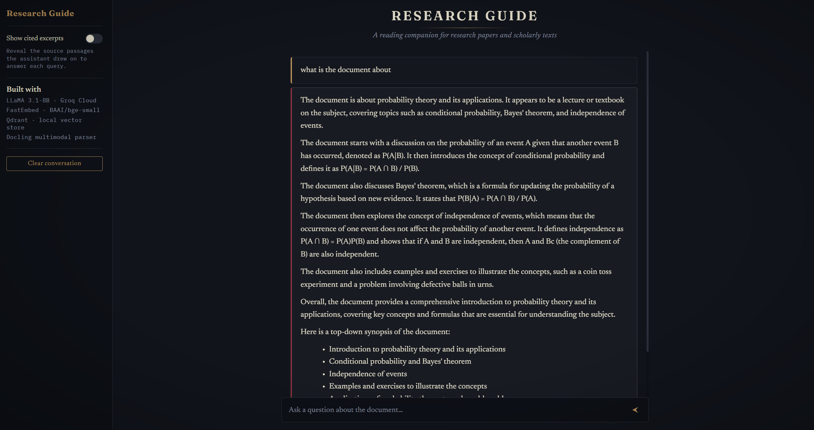

# ◈ Research Guide

**An advanced, locally-vectored Retrieval-Augmented Generation (RAG) interface for deep document analysis.**



> *(Replace `docs/main_ui.png` with your interface screenshot)*

Research Guide is a lightweight, high-performance web terminal built to help you interactively chat with complex documents. It is specifically optimized to handle heavy academic papers, technical reports, and textbooks containing complex LaTeX math, tables, and equations.

---

## Core Features

- **Multimodal Parsing:** Uses `docling` to flawlessly extract text, tables, and equations from PDFs without scrambling the underlying formatting.
- **Local Vector Memory:** Utilizes a local `Qdrant` database and `FastEmbed` (`BAAI/bge-small`) for lightning-fast, private document retrieval without paying for cloud embedding APIs.


---

## How It Works (The RAG Pipeline)

### 1. Ingestion (`parser.py`)

You feed a PDF into the system. `Docling` reads it, extracts the text and math, and chunks it into logical paragraphs.

### 2. Embedding

`FastEmbed` runs locally on your CPU (or NVIDIA GPU) to convert those text chunks into dense mathematical vectors representing their semantic meaning.

### 3. Storage

Those vectors are saved permanently in a local `Qdrant` database folder (`qdrant_db`).

### 4. Retrieval (`app.py`)

When you ask a question in the UI, your query is embedded and compared against the database. The top 15 most relevant document chunks are pulled instantly.

### 5. Generation

The retrieved chunks are injected into a strict system prompt and sent to an LLM to generate an accurate, hallucination-free answer.

---

## Getting Started

### 1. Clone & Setup

Clone the repository and create a clean virtual environment:

```bash
git clone https://github.com/yourusername/research-guide.git
cd research-guide

python -m venv .venv
```

Activate the environment:

**Windows (PowerShell)**

```powershell
.\.venv\Scripts\activate
```

**Mac/Linux**

```bash
source .venv/bin/activate
```

Install the core dependencies:

```bash
pip install -r requirements.txt
pip install fastembed
```

### Install PyTorch with GPU Acceleration (Windows/NVIDIA)

To ensure `docling` and `fastembed` run at maximum speed, install the CUDA 12.8 wheel:

```bash
pip install torch torchvision torchaudio --index-url https://download.pytorch.org/whl/cu128
```

---

## ⚙️ Configure Your LLM Engine

You can run this project using a cloud API for raw speed or entirely offline for maximum privacy.

### Option A: Run via Groq Cloud (Fastest / Default)

This uses LLaMA 3.1 8B on Groq's specialized hardware for near-instant inference.

1. Get a free API key from `console.groq.com`
2. Create a `.env` file in the root directory.
3. Add your key:

```env
GROQ_API_KEY=gsk_your_api_key_here
```

---

### Option B: Run 100% Offline (Maximum Privacy)

If you are analyzing sensitive documents or have no internet connection, you can run the LLM locally using Ollama.

Install Ollama and pull a model:

```bash
ollama run llama3.1:8b
```

In `app.py`, replace `ChatGroq` with `ChatOllama`:

```python
from langchain_community.chat_models import ChatOllama

llm = ChatOllama(
    model="llama3.1:8b",
    temperature=0.0,
)
```

---

## ▶️ Run the System

### Parse a Document

Add your target PDF to the data folder and run the ingestion script:

```bash
python parser.py
```

### Start the Server

Launch the Flask backend:

```bash
python app.py
```

### Chat with Your Documents

Open your browser and navigate to:

```text
http://127.0.0.1:5000
```

You can now interact with your documents through the chat interface.

---

## 🛠 Tech Stack

| Component | Technology |
|------------|------------|
| Backend | Flask, Python |
| Frontend | Vanilla JavaScript, HTML, CSS |
| AI Orchestration | LangChain |
| Vector Store | Qdrant (Local) |
| Embeddings | FastEmbed (`BAAI/bge-small`) |
| Parsing | Docling |

---

## 📌 Architecture Overview

```text
PDF
 │
 ▼
Docling Parser
 │
 ▼
Chunking
 │
 ▼
FastEmbed
 │
 ▼
Qdrant Vector Store
 │
 ▼
Retriever
 │
 ▼
LLM (Groq / Ollama)
 │
 ▼
Streaming Flask API

```

---

